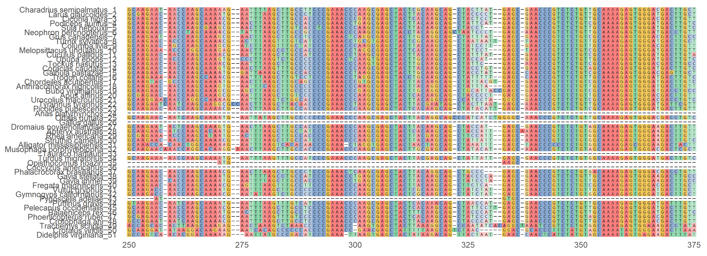

## Introduction

Studies in molecular evolution and genetics often explore how regions of DNA or
genes are conserved or change within a species; these DNA sequences may also be
conserved among other species of organisms. Phylogenies then display how organisms
within a species or among various species relate to each other based on differences
and similarities within a given DNA region.

R contains several packages that are capable of performing the tasks necessary
for Multiple Sequence Alignments and Phylogeny construction.
We will demonstrate these capabilities by aligning and building phylogenies using
some genes conserved among birds to display their relationships to each other.


## Methods

### The Organisms
Bird species were chosen to represent as many classes as possible beneath the
order Aves. The genes picked for this study are mitochondrial genes known to be
conserved among Eukaryotic organisms. 
These bird species and genes were also picked based on a previous phylogenetic
study utilzing mitochondrial genes to study the early history of Modern Birds,
though for this project we will be mainly looking at two infraclasses:
Palaeognathae ("Basal" birds) and Neognathae which contain the majority of living
birds.

Organisms in the outgroup include the American Alligator, Red-Eared Slider,
American Rattlesnake, and Eastern Opossum. Alligators share common ancestry with
birds, while turtles share an ancestor with crocodylians, but not birds. 


### R Packages
The following packages were used for reading DNA data, multiple sequence alignment,
and tree construction:
```{r eval=FALSE, warning=FALSE}
library(tidyverse)
library(BiocManager)
library(ape)
library(phangorn)
library(Biostrings)
library(ggtree)
library(msa)
library(ggmsa)
library(ShortRead)
```


### Sequence clean up
Sequences were collected from NCBI's Genbank database as FASTA files. These files
include the accession number for the genes, the species descriptor and a descriptor
for the sequence data such as the name of the genes. 
Files were read together into R using ShortRead, with some clean up done on the
names to leave only the species name and a numerical identifier to prevent redundancy
for each sequence. 

```{r eval=FALSE, warning=FALSE}
seqs<-ShortRead::readFasta(c(f1,f2))

seqs@id<-
  paste0(
    seqs@id %>% 
      as.character() %>% 
      str_split(" ") %>% 
      map_chr(2),
    " ",
    seqs@id %>% 
      str_split(" ") %>% 
      map_chr(3)
  ) %>% BStringSet()

seqs@id
```


These files were saved into their own FASTA files.
 

### Multiple Sequence Alignment 
These new FASTA files were loaded into R in a DNAStringSet format, where Multiple
Sequence Alignment could be performed through the msa package. msa contains several
methods of aligning sequences: ClustalOmega, ClustalW, and MUSCLE. Each alignment
type also utilize various methods of clustering the alignments, however due to known
issues with clustering in msa, only the Neighbor Joining method was used. 

```{r eval=FALSE, warning=FALSE}
cleanseq<- Biostrings::readDNAStringSet("./Data/Cleaned/sequences_nonredundantCOI.fasta")

alignmentM<-msa::msaMuscle(inputSeqs=cleanseq, cluster="neighborjoining", type="dna", order="input")
```


The resulting alignments are displayed in a MultipleSequenceAlignment format, 
though for Phylogeny Construction the alignments were saved under new FASTA files. 

Images of the alignments were constructed using ggmsa to display a clean alignment
for viewing. Because many alignments were too long to display in their entirety,
only a section of each alignment was displayed.


### Construction of Phylogenies
Tree construction was done mainly through phangorn. The aligned sequences saved
as FASTA files were read into R as a phyDat file. Distance matrices were applied 
to phyDat files, then were built into simple neighbor-joining trees. 
Before moving on, the ape package was used to root the trees to the outgroup. 

From here, bootstrap values were added to the trees and re-rooted if necessary.

Finally, trees were cleaned using ggtree to display the trees in a readable,
sleek format.


## Results

### Multiple Sequence Alignments

```{r  echo=FALSE, out.width='120%', out.height='100%'}


knitr::include_graphics('./Images/COImusclealign_img.png')
```


### Phylogenies

Bootstrapped Maximum Likelihood Tree from 16s Subunit Gene


Bootstrapped Maximum Likelihood Tree from 18s Subunit Gene


Bootstrapped Maximum Likelihood Tree from Cytochrome Oxidase I Gene


## Conclusions
R has access to many useful sequence alignment tools for molecular comparison and
tree construction tools 


## Reference to Study
Marcel van Tuinen, Charles G. Sibley, S. Blair Hedges, The Early History of Modern Birds Inferred from DNA Sequences of Nuclear and Mitochondrial Ribosomal Genes, Molecular Biology and Evolution, Volume 17, Issue 3, March 2000, Pages 451–457, https://doi.org/10.1093/oxfordjournals.molbev.a026324

