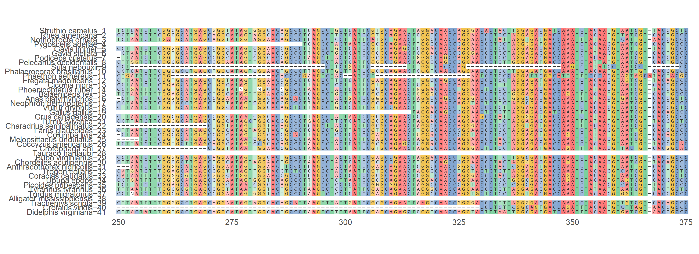
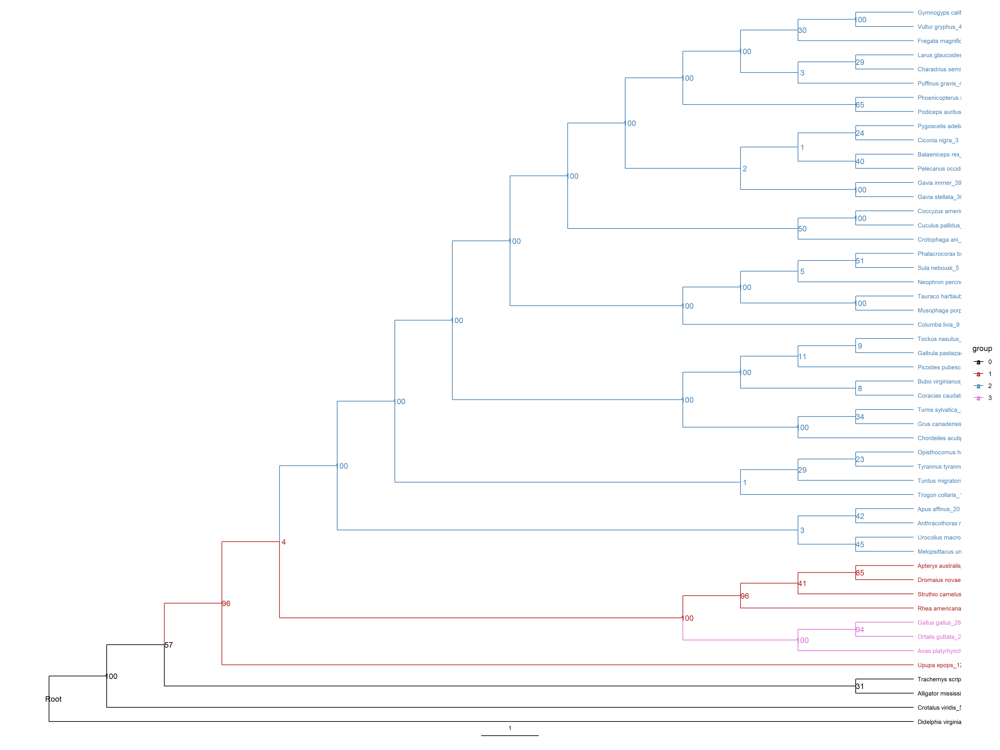

```{r warning=FALSE, include=FALSE}
library(tidyverse)
```

## Introduction

Studies in molecular evolution and genetics often explore how regions of DNA or
genes are conserved or change within a species; these DNA sequences may also be
conserved among other species of organisms. Phylogenies then display how organisms
within a species or among various species relate to each other based on differences
and similarities within a given DNA region.

R contains several packages that are capable of performing the tasks necessary
for Multiple Sequence Alignments and Phylogeny construction.
We will demonstrate these capabilities by aligning and building phylogenies using
some genes conserved among birds to display their relationships to each other.


## Methods

### The Organisms
Bird species were chosen to represent as many classes as possible beneath the
order Aves. The genes picked for this study are mitochondrial genes known to be
conserved among Eukaryotic organisms. 
These bird species and genes were also picked based on a previous phylogenetic
study utilzing mitochondrial genes to study the early history of Modern Birds,
though for this project we will be mainly looking at two infraclasses:
Palaeognathae ("Basal" birds) and Neognathae which contain the majority of living
birds.

Organisms in the outgroup include the American Alligator, Red-Eared Slider,
Prairie Rattlesnake, and Eastern Opossum. Alligators share common ancestry with
birds, while turtles share an ancestor with crocodylians, but not birds. 

```{r echo=FALSE, warning=FALSE}
library(readxl)
list_of_organisms <- read_xlsx("Data/Raw/list_of_organisms.xlsx")
knitr::kable(list_of_organisms,
 caption = "List of Organisms")

```


### R Packages
The following packages were used for reading DNA data, multiple sequence alignment,
and tree construction:
```{r eval=FALSE, warning=FALSE}
library(tidyverse)
library(ape)
library(phangorn)
library(BiocManager)

library(Biostrings)
library(ggtree)
library(msa)
library(ggmsa)
library(ShortRead)
```

The top four libraries are available through CRAN while the last five are obtained
through BioConductor. The BiocManager package is used to install other BioConductor
related packages.

### Sequence clean up
Sequences were collected from NCBI's Genbank database as FASTA files. These files
include the accession number for the genes, the species descriptor and a descriptor
for the sequence data such as the name of the genes. 
Files were read together into R using ShortRead, with some clean up done on the
names to leave only the species name and a numerical identifier to prevent redundancy
for each sequence. 

```{r eval=FALSE, warning=FALSE}
seqs<-ShortRead::readFasta(c(f1,f2,f3))

seqs@id<-
  paste0(
    seqs@id %>% 
      as.character() %>% 
      str_split(" ") %>% 
      map_chr(2),
    " ",
    seqs@id %>% 
      str_split(" ") %>% 
      map_chr(3)
  ) %>% BStringSet()

seqs@id

ShortRead::writeFasta(object = seqs, file = "./Data/Cleaned/sequences_16s.fasta", mode ="w")
sequences<- Biostrings::readDNAStringSet("./Data/Cleaned/sequences_16s.fasta")

sequences_s<- ShortRead::readFasta("./Data/Cleaned/sequences_16s.fasta")
newids <- BStringSet(paste0(sequences_s@id, "_",1:length(sequences_s)))
sequences_s@id <- newids
sequences_s@id

writeFasta(sequences_s,"./Data/Cleaned/sequences_nonredundant16s.fasta")
```


These files were saved into their own FASTA files.
 

### Multiple Sequence Alignment 
These new FASTA files were loaded into R in a DNAStringSet format, where Multiple
Sequence Alignment could be performed through the msa package. msa contains several
methods of aligning sequences: ClustalOmega, ClustalW, and MUSCLE. Each alignment
type also utilize various methods of clustering the alignments, however due to known
issues with clustering in msa, only the Neighbor Joining method was used. 

```{r eval=FALSE, warning=FALSE}
cleanseq<- Biostrings::readDNAStringSet("./Data/Cleaned/sequences_nonredundant16s.fasta")

alignmentM<-msa::msaMuscle(inputSeqs=cleanseq, cluster="neighborjoining", type="dna", order="input")
```


The resulting alignments are displayed in a MultipleSequenceAlignment format, 
though for Phylogeny Construction the alignments were saved under new FASTA files. 
```{r eval=FALSE}
ShortRead::writeFasta(DNAStringSet(alignmentM),"./Data/Cleaned/alignmentM_16s.fasta")
```


Images of the alignments were constructed using ggmsa to display a clean alignment
for viewing. Because many alignments were too long to display in their entirety,
only a section of each alignment was displayed.
```{r eval=FALSE}
alignM16s<- read.FASTA("./Data/Cleaned/alignmentM_16s.fasta")
ggmsa(alignM16s, 250, 375, color = "Chemistry_NT", font = "DroidSansMono", 
      char_width = 0.7, seq_name = TRUE, border=NA, by_conservation=TRUE)
```


### Construction of Phylogenies
Tree construction was done mainly through phangorn. The aligned sequences saved
as FASTA files were read into R first as a DNAMultipleAlignment file, then a
phyDat file. Distance matrices were applied to phyDat files, then were built into 
a simple neighbor-joining tree. 
Before moving on, the ape package was used to root the trees to the outgroup. 
```{r eval=FALSE}
alignM16sSet<- readDNAMultipleAlignment("./Data/Cleaned/alignmentM_16s.fasta")

align_phyDatM<-msa::msaConvert(x=alignM16sSet, type= "phangorn::phyDat")

phydist<-dist.ml(align_phyDatM)


nj<- phangorn::NJ(phydist)

ape::is.rooted(nj)
root_nj<-ape::root(phy = nj,"Didelphis virginiana_51",
                   resolve.root=TRUE)
```


From here, bootstrap values were added to the trees and re-rooted if necessary.
Bootstrapping was repeated 100 times for each tree.

We chose the Maximum Likelihood method of tree construction as opposed to methods
such as Maximum Parsimony or other distance-based methods because it tends to be
the most accurate method of constructing trees under a wider variety of conditions.
In exchange, this method relies on the evolutionary model chosen to account for
base pair changes.

Boostrapping is a test that utilizes random sampling and resampling to test how
often the same branch is observed on a phylogenetic tree. A score is given to each
node on a branch to show how many times out of 100 that particular branch is seen.
Scores between 90 to 100 are good indicators that the branch is well supported.
Scores below 90 have less confidence in supporting the indicated relationship.

```{r eval=FALSE}
fit <- pml(root_nj, align_phyDatM)
fit <- optim.pml(fit, rearrangement="NNI")

bs <- bootstrap.pml(fit, bs=100, optNni=TRUE)
treeBS <- plotBS(fit$tree, bs, type ="phylogram")

root_bs<- ape::root(phy = treeBS,"Didelphis virginiana_51", resolve.root=TRUE)
plotBS(root_bs, type="phylogram")
```


Finally, trees were cleaned using ggtree to display the trees in a readable format
while also highlighting parts of the tree.

```{r eval=FALSE}
tree <- groupClade(root_bs, c(83,55,90))
p <- ggtree(tree2, aes(color=group), branch.length="none", layout="rectangular") + 
  scale_color_manual(values=c("black","firebrick", "steelblue", "orchid"))+
  geom_tiplab(alignt=FALSE, size=3)+
  geom_treescale(fontsize=3)+
  ggtree::geom_nodelab(node= 'internal')
```


## Results

### Multiple Sequence Alignments


[](https://soniaflores1.github.io/images/16smusclealign_img.png)
A section of the aligned 16s Gene sequences in birds and outgroup animals

[](https://soniaflores1.github.io/images/18smusclealign_img2.png)
A section of the aligned 18s Gene sequences in birds and outgroup animals


[](https://soniaflores1.github.io/images/COImusclealign_img.png)
A section of the aligned Cytochrome Oxidase I Gene sequences in birds and outgroup animals

While these images only display a given 125 base pair long section of the alignments,
we can see some significant overlap between most sequences, as well as highly
conserved sections of the sequences across all species as denoted by the bold
coloration of the cells. The colorless dashed cells indicate gaps in the alignment.
Several sequences in the alignments have multiple gaps scattered throughout the
alignment while others tend to show gaps in the same areas of a given alignment.
These gaps indicate missing sequence data either due to errors in extracting or 
cleaning DNA or unspecified base calls during sequencing. 


### Phylogenies
[](https://soniaflores1.github.io/images/16s_tree.png)

[](http://soniaflores1.github.io/images/16s_radtree.png)
Bootstrapped Rectangular and Circular Maximum Likelihood Trees from 16s Subunit Gene

[](https://soniaflores1.github.io/images/18s_tree.png)

[](http://soniaflores1.github.io/images/18s_radtree.png)
Bootstrapped Rectangular and Circular Maximum Likelihood Tree from 18s Subunit Gene

[](https://soniaflores1.github.io/images/COI_tree.png)

[](http://soniaflores1.github.io/images/COI_radtree.png)
Bootstrapped Rectangular and Circular Maximum Likelihood Tree from Cytochrome Oxidase I Gene

Across all trees the outgroups were colored black, the Palaeognathae Birds are
denoted by red, and Neoganathae birds are colored in blue. Some clades which appear
to be completely misplaced on the tree are shown in pink.

Several branches on each of the trees show some consistency with how many times
they are observed on the trees, however other nodes either display low bootstrap
scores for closely associated clades or high scores for clades that should not
have close relationships.


## Conclusions
R has access to many useful sequence alignment tools for molecular and genetic
analyses, as well as many ways to construct and format trees to display the
relationships derived from those analyses. The msa package is one of the easier
alignment tools to use, however it has significant limitations with what types of
clustering it can do, as well as technical issues with certain alignment types.
As mentioned earlier, only the Neighbor Joining method of clustering was available
due to known errors in msa when using UPGMA clustering methods. Alignment using
msa also suffered from memory leak issues when aligning more than 50 sequences 
or very long sequences, especially when large gaps were present.

While the msa package had its issues with aligning the sequences, the sequences
themselves may also play a part into why the alignments and resulting trees from
those alignments displayed strange relationships between organisms. While NCBI is
an expansive depository for DNA, RNA, and protein sequences, it is not well curated
and some sequences may be erroneously named or misrepresentative of the gene or
proteins they describe.

With regards to the Phylogenies, Maximum Likelihood trees depends heavily on the
alignments themselves to obtain a good model to use in order to predict nucleotide
changes at any position in the aligned sequences. If the sequences are not aligned
in the best way possible, then the evolutionary model chosen to construct the tree
may not appropriately represent what is actually happening between the organisms
represented on the tree.

The msa package is a good introduction to sequence alignment in R, however for
serious studies using sequence alignment, other alignment packages are available
for use with better ongoing support and options for clustering. Better alignment
tools will also improve the accuracy of trees constructed from the resulting
alignments. 

## Reference to Study
Marcel van Tuinen, Charles G. Sibley, S. Blair Hedges, The Early History of Modern Birds Inferred from DNA Sequences of Nuclear and Mitochondrial Ribosomal Genes, Molecular Biology and Evolution, Volume 17, Issue 3, March 2000, Pages 451–457, https://doi.org/10.1093/oxfordjournals.molbev.a026324

